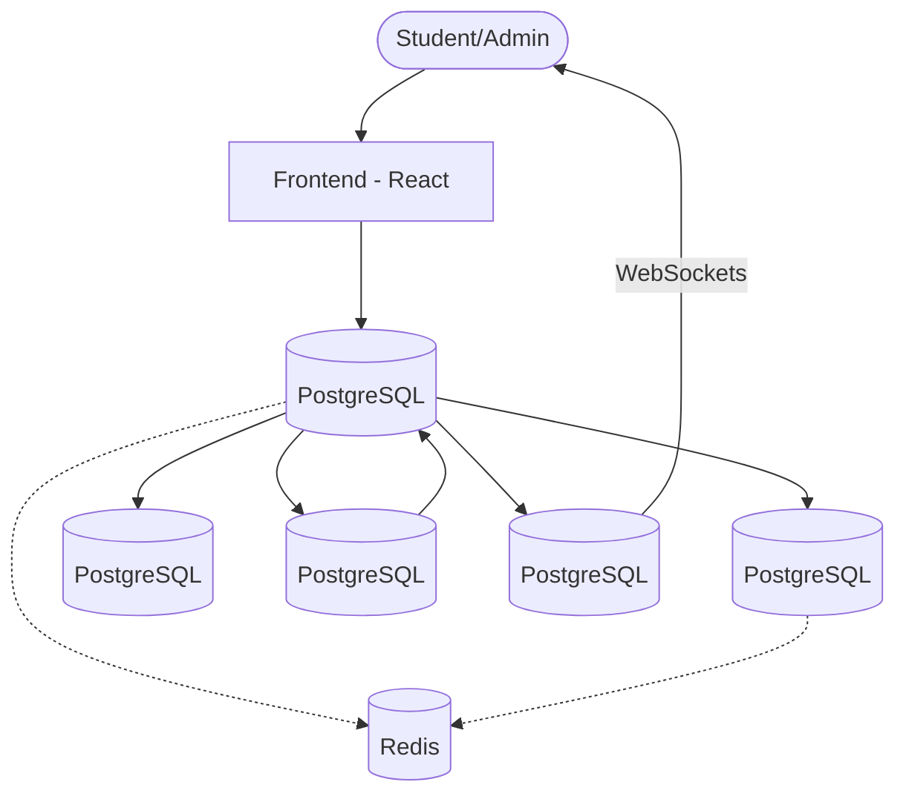

# Dev Sprint 2026 - Student Cafeteria Ordering Platform

> [!IMPORTANT]
> **Hackathon Status**: This project was developed for a **DevOps & Microservices Hackathon**. It serves as a reference implementation for a distributed system using container orchestration, service discovery, and resilient architecture.

Dev Sprint 2026 is a modern, microservices-based student cafeteria ordering platform. It features real-time notifications, a vibrant React frontend, and a robust Django backend distributed across five specialized services.

## 🛠️ DevOps & Microservice Highlights

- **Containerization**: Every service is Dockerized with optimized `Dockerfile`s and orchestrated via `docker-compose`.
- **Service Discovery**: Automatic discovery via Docker DNS, enabling seamless inter-service communication.
- **Resilience**: Integrated health checks for database and cache to ensure zero-downtime startup sequences.
- **Observability**: Standardized logging and metrics endpoints (`/metrics/`) for performance monitoring.
- **Chaos Engineering**: Built-in "Chaos Mode" to test system behavior during simulated network or service failures.

## 🚀 Key Features

- **Microservices Architecture**: Five independent Django services communicating via REST and Redis Pub/Sub.
- **Real-time Notifications**: Instant updates on order status via WebSockets (Django Channels).
- **Modern Frontend**: A fast, responsive React + Vite application with a premium Red & White design system.
- **Secure Authentication**: JWT-based stateless authentication with rate limiting.
- **Chaos Testing**: Built-in toggles to simulate service failures and test system resilience.
- **Dockerized Environment**: Fully containerized setup for consistent development and deployment.

## 🏗️ Architecture

The system consists of the following components:



### Services Breakdown

| Service | Port | Description |
| :--- | :--- | :--- |
| **Identity Provider** | 8001 | Handles student registration, login, and JWT token issuance. |
| **Stock Service** | 8002 | Manages food items, menu, and real-time stock levels. |
| **Order Gateway** | 8003 | The central entry point for orders; coordinates between all services. |
| **Kitchen Queue** | 8004 | Manages the order lifecycle from preparation to "ready" status. |
| **Notification Hub**| 8005 | Handles real-time communication via WebSockets. |
| **Frontend** | 3000 | The user interface for students and administrators. |

## 🛠️ Setup & Execution

### Prerequisites

- [Docker](https://docs.docker.com/get-docker/)
- [Docker Compose](https://docs.docker.com/compose/install/)

### Quick Start

1. **Clone the repository**:
   ```bash
   git clone <repository-url>
   cd devsprint2026
   ```

2. **Start the application**:
   ```bash
   chmod +x start.sh
   ./start.sh
   ```
   *Note: This script runs `docker-compose up --build` and ensures all services are initialized.*

3. **Access the services**:
   - **Frontend**: [http://localhost:3000](http://localhost:3000)
   - **Order Gateway API**: [http://localhost:8003](http://localhost:8003)
   - **Identity Provider API**: [http://localhost:8001](http://localhost:8001)

## 📄 API Documentation

For a detailed list of all available endpoints, request/response formats, and example flows, please refer to the [API Summary](API_SUMMARY.txt).

## ⚙️ Environment Variables

The project uses a default set of environment variables configured in `docker-compose.yml`. Key variables include:

- `DJANGO_SECRET_KEY`: Security key for Django services.
- `DB_HOST`: Database host (defaults to `db`).
- `REDIS_URL`: Redis connection string (defaults to `redis://redis:6379`).

## 🧪 Testing and Chaos Mode

Each service includes a `/chaos/` endpoint (admin only) to toggle chaos mode, allowing you to simulate failures in specific parts of the microservices ecosystem to verify system stability and error handling.

## 🤖 AI Usage Details

> AI usage was allowed and encouraged in this hackathon. This project was developed with AI assistance, under full human direction and review.

### 🔧 Tools Used

- **Claude** – Used to generate the initial backend codebase and refine functions through detailed, personalized prompts.
- **Cursor** – Used to generate and iterate on the React frontend using structured prompts.
- **Antigravity** – Used for endpoint validation, mismatch detection, and debugging during service integration.
- **Agentic AI tools** – Used to assist in generating project documentation.

---

### 🧠 Nature of AI Assistance

AI was primarily used for:

- Generating initial boilerplate code for services
- Writing and refining Docker and microservice configurations
- Debugging integration issues (Redis, service communication, endpoints)
- Detecting API mismatches across services
- Improving and refactoring functions through prompt-driven iteration
- Generating documentation drafts

---

### 👨‍💻 Human Oversight & Architectural Ownership

- All architectural decisions (microservices separation, Redis Pub/Sub, JWT authentication, chaos engineering approach) were conceptualized and directed by the project author.
- AI tools were used strictly as implementation assistants.
- Every AI-generated code segment was:
  - Fully reviewed
  - Understood
  - Modified where necessary
  - Debugged manually

As a first-time developer working with a distributed microservices system, AI was used as an accelerator — not as a replacement for understanding. All core ideas, system design decisions, and feature planning originated from the author.

---

### 🚫 AI in Production System

The deployed cafeteria platform itself does **not** include any AI-driven features.  
AI tools were used solely during the development process.

---

### 🎯 Summary

This project represents a human-led system design implemented with AI-assisted development.  
AI functioned as a coding co-pilot, while architectural vision, integration decisions, and final validation remained fully human-controlled.

## 🔐 Default Login Credentials

For demonstration and testing purposes, the system is pre-seeded with the following accounts:

### 👨‍🎓 Student Accounts

| Student ID | Password     |
|------------|--------------|
| 210041001  | password123  |
| 210041002  | password123  |

---

### 👨‍💼 Admin Account

| Admin ID  | Password  |
|-----------|-----------|
| admin001  | admin123  |

---

> ⚠️ These credentials are intended strictly for development and hackathon demonstration.
> In a production deployment, default credentials must be removed and replaced with secure authentication policies.

